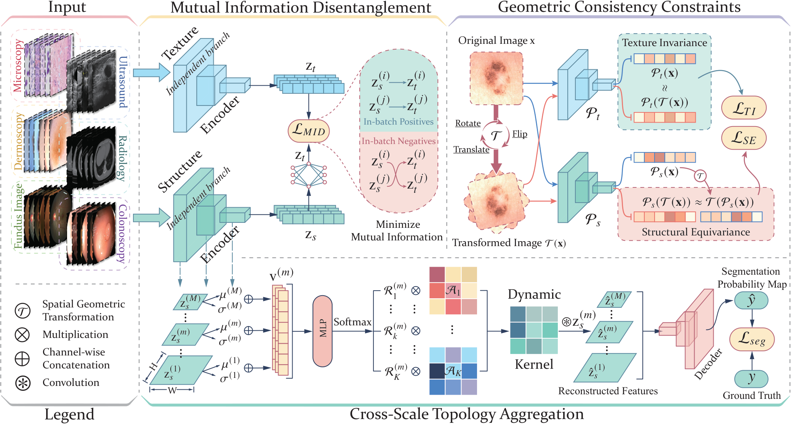

<h1 align="center">[OrthoSeg] Learning Orthogonal Disentanglement for Domain-Generalizable Medical Image Segmentation</h1>

<p align="center">
  Kai Han, Jiaqi Zhang, Chongwen Lyu, Mengting Li, Jun Chen, Laihua Yang, Guangquan Zhou, Yang Chen, Zhe Liu
</p>
# 📌 Abstract

Medical image segmentation is vital for clinical diagnosis, lesion localization, treatment planning, and efficacy evaluation. However, traditional models struggle to maintain consistent performance across modalities due to significant variations in textures and imaging principles. To address this challenge, we propose OrthoSeg, a domain-agnostic framework for general medical image segmentation. By orthogonally disentangling anatomical structures from textures, OrthoSeg removes domain-specific interference to capture consistent representations. Specifically, we first design a mutual information-based module to disentangle latent representations, separating domain-agnostic structures from domain-specific textures for effective noise suppression. Second, we enforce spatial geometric consistency via equivariance and invariance penalties to reduce ambiguity and enhance boundaries. Finally, cross-scale topological aggregation is proposed to address lesion scale variations, dynamically adjusting receptive fields and reconstructing target anatomies. OrthoSeg outperforms state-of-the-art methods across seven source and eight unseen datasets in six modalities. It mitigates domain-specific noise and demonstrates promising generalization to unseen domains, taking a step towards robust, domain-agnostic medical image segmentation.

## 🎇 Method Overview

<p align="center">
  
</p>

## 💡 Key Features

- We propose OrthoSeg, a structure-texture orthogonal disentanglement framework that isolates anatomical structures from domain-specific textures for cross-domain medical image segmentation.
- We design Mutual Information Disentanglement (MID) and Geometric Consistency Constraints (GCC) to construct a domain-agnostic representation space through spatial equivariance and invariance penalties.
- We introduce Cross-Scale Topology Aggregation (CSTA) to dynamically embed anatomical topology priors and reconstruct complex organ boundaries across different resolutions and scales.
- Experiments on 15 datasets across six imaging modalities demonstrate state-of-the-art cross-domain generalization with 11.76M parameters.

## 🚀 Installation & Usage

### 1. Environment

```bash
git clone https://github.com/JiaqiZhang-Sengoku/OrthoSeg.git
cd OrthoSeg

python -m venv .venv

python -m pip install -e .
```

### 2. Dataset Preparation

Download medical image segmentation dataset in following links:
  1) ISIC2018: https://challenge.isic-archive.com/data/
  2) COVID19-1 & BUSI & Polyp Segmentation Dataset: https://github.com/Xiaoqi-Zhao-DLUT/MSNet-M2SNet
  3) DSB2018: https://www.kaggle.com/c/data-science-bowl-2018
  4) PH2 test dataset: https://www.fc.up.pt/addi/ph2%20database.html
  5) COVID19-2 test dataset: https://www.kaggle.com/datasets/piyushsamant11/pidata-new-names
  6) STU: https://drive.google.com/file/d/1k3OvEnYZaPWrng74aP4hAhgPXNHjpPj3/view?usp=drive_link
  7) MonuSeg2018: https://www.kaggle.com/datasets/tuanledinh/monuseg2018

Prepare explicit manifests as follows:

```text
data/
└── manifests/
    ├── train.csv
    ├── val.csv
    └── test.csv
```

Binary segmentation manifests use:

```csv
image_path,mask_path
images/case_001.png,masks/case_001.png
```

Fundus optic-disc/optic-cup manifests use:

```csv
image_path,od_mask_path,oc_mask_path
images/case_001.png,od_masks/case_001.png,oc_masks/case_001.png
```

### 3. Training

```bash
python -m orthoseg train --config configs/example.json
```

Using the retained dataset indexes:

```bash
python -m orthoseg train --config configs/example_indexed.json
```

### 4. Evaluation

```bash
python -m orthoseg evaluate \
  --config configs/example.json \
  --checkpoint runs/example/best.pt \
  --split test
```

## 📂 Outputs

```text
runs/{experiment}/
```

## 📢 LICENSE

The project is under [MIT License](./LICENSE), and is for research purpose ONLY.

## 🎈 Acknowledgements

Our implementation is built upon [MADGNet](https://github.com/Inha-CVAI/MADGNet). We thank the authors for their excellent work.
